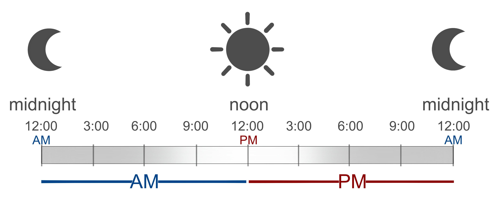

У вас есть переменные `start`, `end`, которые содержат входные пользовательские данные.

Напишите код, которые подсчитывает сколько часов прошло от `start` до `end` и записывает результат в переменную `result`.

Входящий формат: **12-часовой формат** времени, где **AM** и **PM** — это сокращения, использующиеся для обозначения времени суток. 

 



**Sample Input 1:**

```
9:00 AM | 9:00 AM
```

**Sample Output 1:**

```
0
```

**Sample Input 2:**

```
9:00 AM | 10:00 AM
```

**Sample Output 2:**

```
1
```

**Sample Input 3:**

```
9:00 AM | 10:00 PM
```

**Sample Output 3:**

```
13
```