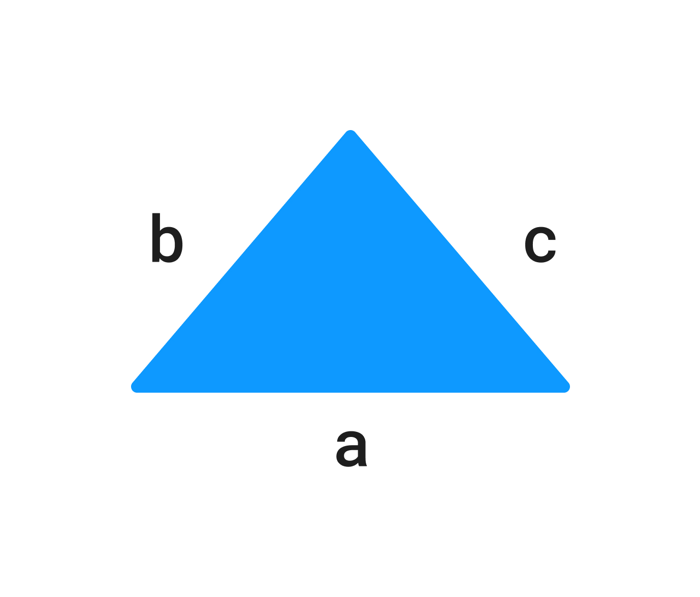

У вас есть переменные `a`, `b`, `c`, которые содержат входные пользовательские данные.

`a`, `b`, `c` – стороны треугольника.

Напишите код, который находит периметр треугольника и записывает результат в переменную `result`.

Периметр треугольника равняется сумме всех его сторон: P=a+b+c*P*=*a*+*b*+*c*
где P*P* – это периметр и a,b,c*a*,*b*,*c* – стороны треугольника.



**Sample Input:**

```
1 | 1 | 1
```

**Sample Output:**

```
3
```