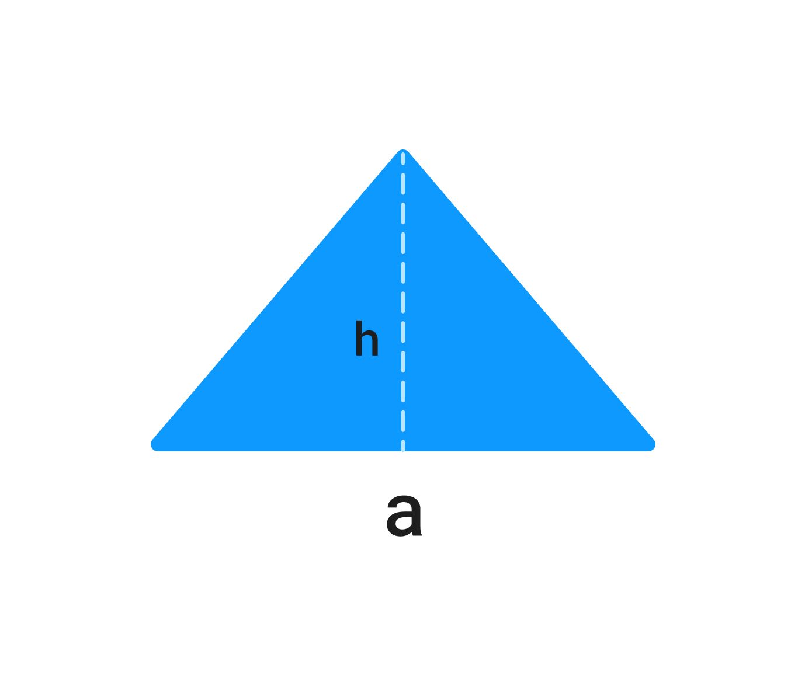

У вас есть переменные `a`, `h`, которые содержат входные пользовательские данные.

`a` – основание.

`h` – высота.

Напишите код, который находит площадь треугольника и записывает результат в переменную `result`.

Самая простая формула для расчета площади это произведение основания и высоты треугольника, поделенное на 2:
***S=(a⋅h)/2\*S\*=(\*a\*⋅\*h\*)/2***, где S*S* – это площадь, a*a* – основание, h*h* – высота.



**Sample Input:**

```
4 | 4
```

**Sample Output:**

```
8
```