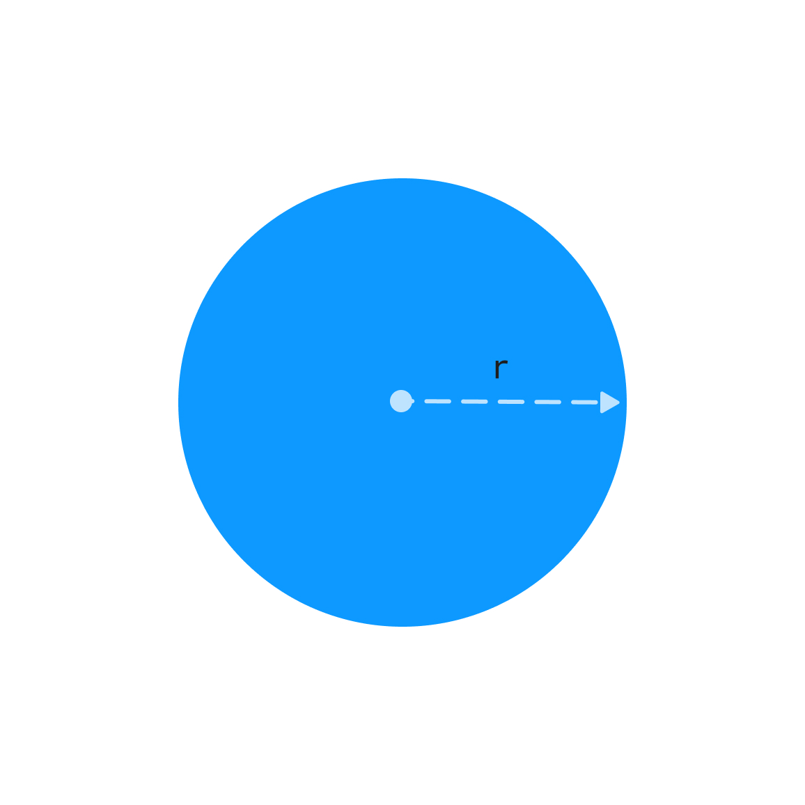

У вас есть переменная `r`, которая содержит входные пользовательские данные.

`r` – радиус.

Напишите код, который находит периметр круга и записывает результат в переменную `result`.

Формула расчета периметра круга: C*=2⋅*π*⋅*r* , где *C* это периметр, *r* – радиус, *π* – число пи.



**Sample Input:**

```
5
```

**Sample Output:**

```
31.42
```