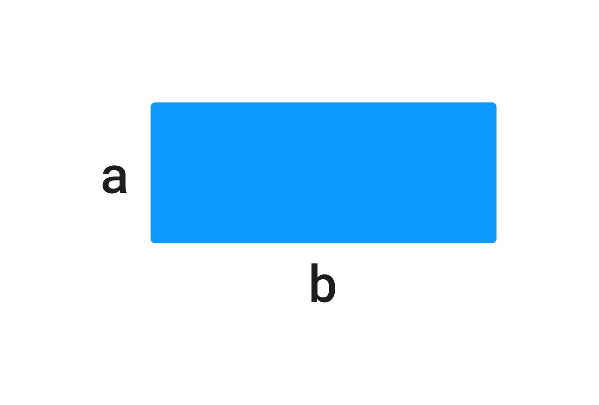

У вас есть переменные `a`, `b`, которые содержат входные пользовательские данные.

`a` – длина.

`b` – ширина.

Напишите код, который находит площадь прямоугльника и записывает результат в переменную `result`.

Формула расчета площади прямоугольника: S=a⋅b*S*=*a*⋅*b*, где S*S* — площадь; a,b*a*,*b* — длина и ширина.



**Sample Input:**

```
4 | 4
```

**Sample Output:**

```
16
```