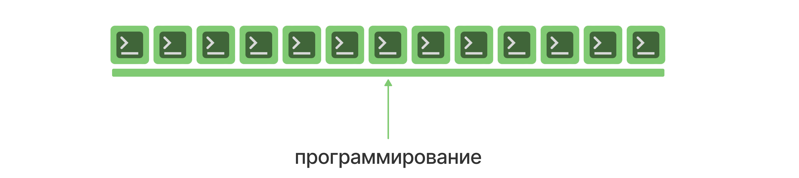
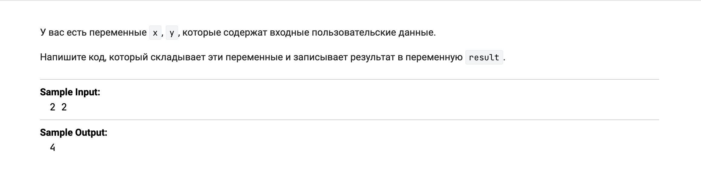
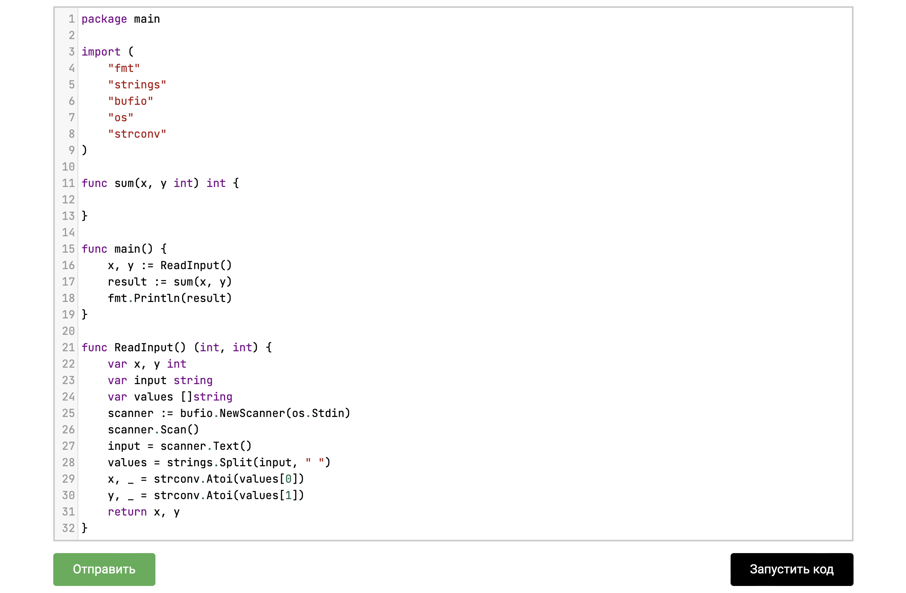
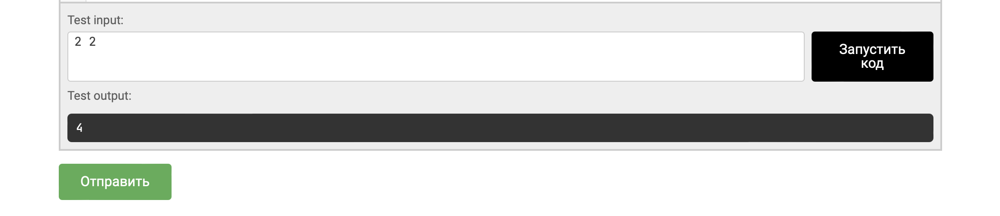
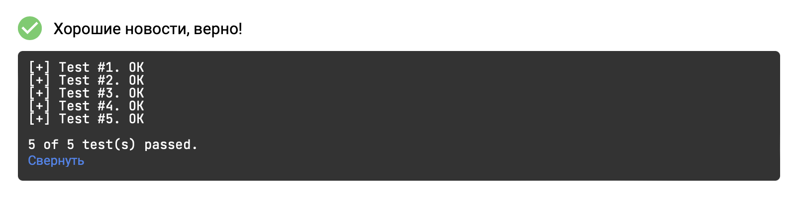
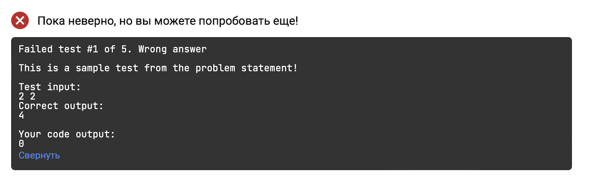
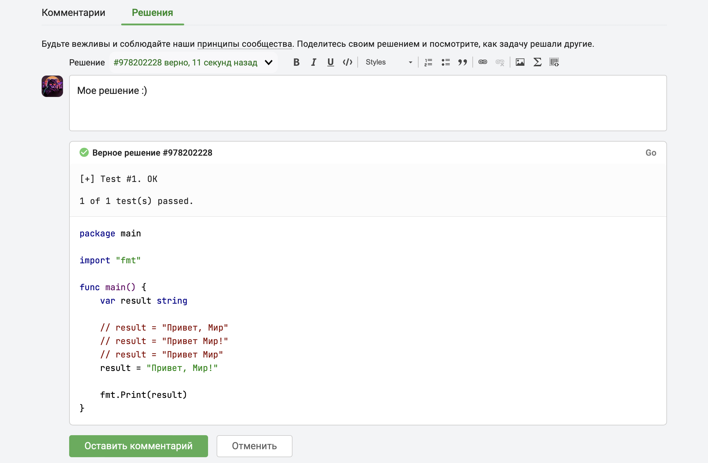
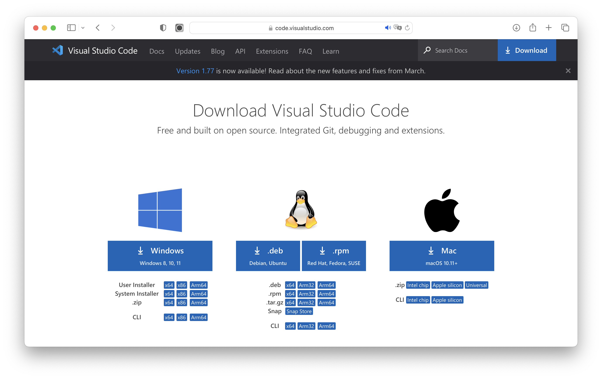
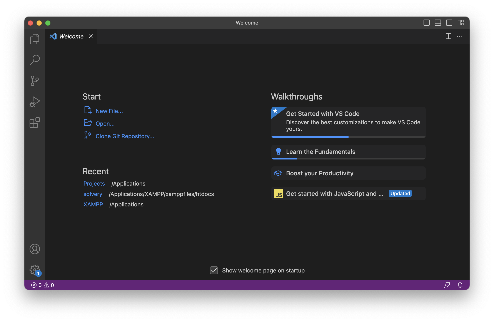
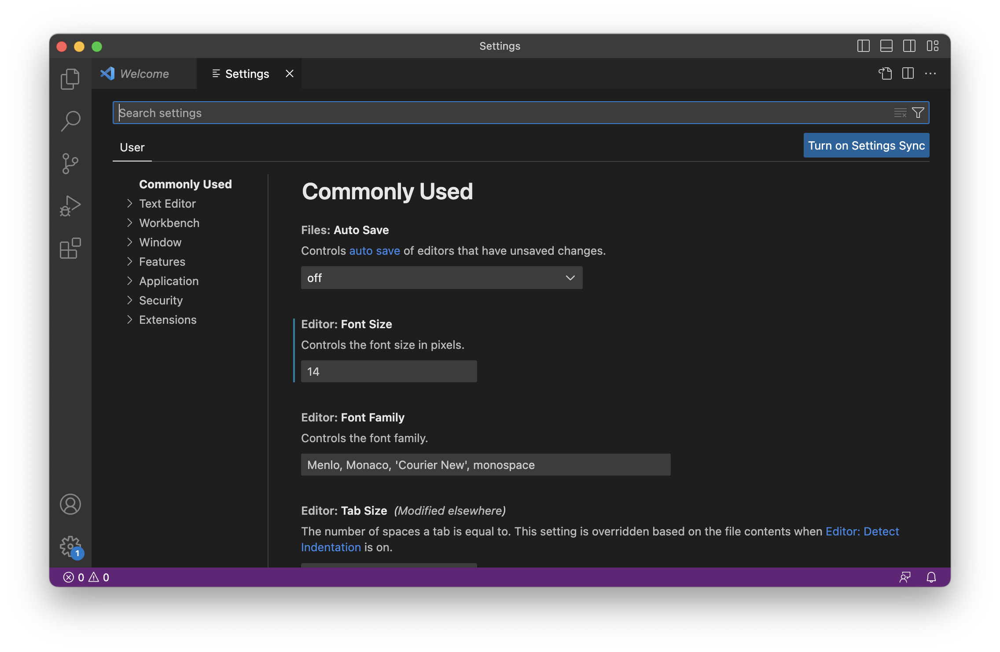

# Добро пожаловать на курс "Практический Тренажер по GO"!

 


 

**Go** (или **Golang**) - это высокоуровневый язык программирования, разработанный компанией **Google**. Он был создан с целью упростить разработку программных приложений, обладать высокой производительностью и быть легким в использовании. Основные принципы, лежащие в основе языка **Go**, - это простота, эффективность и надежность.

**Go** имеет огромное сообщество разработчиков, которые активно поддерживают и развивают язык, предлагая множество библиотек и модулей, которые значительно упрощают разработку. **Go** также является одним из наиболее востребованных языков программирования на рынке труда, что делает его привлекательным выбором для тех, кто стремится к карьерному росту.


Этот **курс состоит исключительно из практических задач**, которые помогут вам улучшить свои навыки в работе с переменными, типами данных, условными конструкциями, циклами, функциями, массивами, строками в **Go**. В ходе выполнения задач вы научитесь применять свои знания на практике, улучшите навыки работы с **Go** и укрепите уверенность в своих возможностях.

Кроме того, в этом курсе **включены задачи на собеседования**. Они позволят вам не только отработать навыки работы с **Go**, но и подготовиться к собеседованию на позицию **Go-разработчика**. Вы научитесь решать типичные задачи, которые могут быть предложены на собеседовании, и узнаете, как правильно формулировать свои ответы.

Таким образом, этот курс поможет вам улучшить навыки работы с **Go** и подготовиться к собеседованию на позицию **Go-разработчика**.


## Вы научитесь:

- Разбираться в работе с переменными, типами данных, управляющими структурами, функциями в **Go**.
- Решать практические задачи и находить эффективные решения в **Go**.
- Подготовиться к собеседованию на позицию **Go**-разработчика, включая задачи, которые могут быть заданы на собеседовании.
- Развивать аналитическое мышление и научиться решать задачи различной сложности в **Go**.
- Укрепить свои знания и навыки в работе с **Go**, повысить уверенность в своих навыках и стать более профессиональным **Go**-разработчиком.

###  

## **Курс будет полезен:**

Специалистам в сфере информационных технологий, разработчикам программного обеспечения, разработчикам серверной части, разработчикам распределённых систем, специалистам по обработке данных, системным администраторам, а также специалистам по тестированию программного обеспечения.

 

## **Задачи курса:**

Все практические задачи курса с использованием программной платформы **Go (1.22.1)** можно решать столько раз, сколько вы пожелаете. За ошибки баллы не снимаются, поэтому не бойтесь пробовать и ошибаться!

 

## **Сроки**

Этот курс не имеет сроков и может быть пройден в удобное для вас время.
Однако для достижения хороших результатов лучше заниматься регулярно.  

 

## **Общение**

Вы будете заниматься в компании других студентов курса. Общаться друг с другом можно в комментариях к урокам курса.
Пожалуйста, не оставляйте решения и подсказки в комментариях, для этого есть отдельная ветка комментариев.
Прежде чем писать, прочитайте [правила сообщества Stepik](https://support.stepik.org/hc/ru/articles/4407228615058) и [нормы поведения](https://stepik.org/lesson/986210/step/2?unit=993505).  

 

## **Вопросы**

Если у вас возникли сложности с конкретным уроком, обращайтесь к команде курса в комментариях к уроку.  

 

## Сертификация

Если вы прошли задания курса успешно, вам будет выдан сертификат об успешном прохождении данного курса. 
Для получения обычного сертификата необходимо набрать **не менее 350 баллов**.
Для получения сертификата с отличием необходимо набрать **не менее 370 баллов**.

 

## Удачного прохождения курса!

Порекомендуйте курс друзьям и знакомым, ведь вместе проходить его гораздо интереснее!

# Нормы поведения

Нормы поведения помогают создавать сообщество, в основе которого лежит доброта, сотрудничество и взаимное уважение.

Хотите ли вы получить ответ на свой вопрос или пришли поделиться знаниями с коллегами, пожалуйста, присоединяйтесь к созданию сообщества, где комфортно всем и любой желающий может принять участие вне зависимости от уровня знаний и личностных качеств.

Действие норм распространяется на всех участников данного курса!

 

## Ожидаемое поведение

- **Будьте дружелюбными и доброжелательными!**
  Предполагайте добрые намерения, избегайте сарказма и будьте осторожны с шутками — письменная речь плохо передаёт тон высказываний. Если складывается ситуация, в которой вы не можете более оставаться дружелюбным, прекратите разговор вовсе.
  
- **Если вы пришли помогать другим, будьте терпеливы и доброжелательны!**
  Протяните руку помощи, если вы заметили участника, который испытывает трудности или нуждается в какой-либо иной поддержке.
  
- **Если вы хотите оставить отзыв участнику, будьте предельно ясны и конструктивны!**
  Увидев отзыв к вашему сообщению, примите его открыто.
  Правки, комментарии и предложения — важнейшие части нашей культуры.

 

## Неприемлемое поведение

- **Никаких резких замечаний или враждебно настроенных фраз.**
  Какими бы ни были ваши намерения, подобное поведение может негативно отразиться на ваших коллегах.
  
- **Никаких переходов на личности или личных выпадов.**
  Сосредоточьтесь на содержимом, а не на личности. Не используйте слова, связанные с человеческими качествами (например, «ленивый»), даже если ими можно описать содержание сообщения.
  
- **Никакой травли.**
  Неприемлемы высказывания, которые могут обидеть человека или сделать его чужим на основании его расы, пола, сексуальной ориентации или религии — и это лишь несколько примеров. Если у вас появились любые сомнения о допустимости высказывания, не пишите его.
  
- **Никакого преследования.**
  В том числе, но не ограничиваясь: травля, шантаж, нецензурная лексика, прямые и завуалированные угрозы, высказывания сексуального характера, неприличное и бестактное поведение, а также постоянное неконструктивное встревание в дискуссии.
  
- **Никакой токсичности.**
  Спекуляции, распространение слухов и деструктивная критика.
  Игнорирование и неуважение к мнению и чувствам других участников.
  Подрыв поддержки и сотрудничества в группе.
  Использование языка или поведения, создающего враждебную атмосферу.
- **Никакой пассивной агрессии.**
  Уклонение от конструктивного обсуждения и поиска решений.
  Манипулятивное поведение для достижения своих целей.
  Специально создание ситуаций, которые могут вызвать дискомфорт или проблемы в группе.
  Выражение недовольства или критики через использование саркастического или иронического тона.
  Распространение негативной информации о других людях с целью подорвать их репутацию.

 

## Соблюдение норм

1. **Предупреждение.**
   Как правило, если это первое нарушение, администраторы/команда курса удалят оскорбительное содержимое и отправят его автору предупреждение. Чаще всего проблемы решаются на этом этапе.
   
2. **Блокировка.**
   При повторных нарушениях или в случае преследования, травли или унижений, модераторы или администраторы блокируют доступ к сообществу на некоторое время (один день или больше — в зависимости от серьёзности ситуации).

 

## Если вы видите, что что-то идёт не так

Каждый участник вносит вклад в создание дружелюбной атмосферы и взаимного уважения в сообществе. 
Если вы столкнулись с неприемлемым поведением, направленным на вас или другого человека, вы можете: cвязаться с администраторами/командой курса.

Действующие нормы поведения созданы для того, чтобы подчеркнуть то уважительное отношение, которое участники ожидают друг от друга. Имея нормы поведения, мы всегда можем подкорректировать нашу культуру, если она вдруг отклонится от намеченного курса.

Благодарим вас за ваш вклад в создание дружелюбного сообщества, где участники относятся друг к другу с уважением!


# Структура курса

**Курс состоит из:** задач на программирование.



## Задачи на программирование

В этой части курса вы будете решать практические задачи, которые требуют от вас написания кода на языке **Go**.
Задачи будут различной сложности и будут требовать от вас применения различных концепций языка **Go**. 

За успешное прохождение задач на программирование вы получаете:

- (★) 1 балл (за каждую задачу простой сложности).
- (★★) 2 балла (за каждую задачу средней сложности).
- (★★★) 3 балла (за каждую задачу высокой сложности).

Задачи на программирование проверяются автоматически платформой **Stepik**. Вашей программе на вход подаются входные пользовательские данные, а на выходе проверяется результат ее работы. У каждой задачи на программирование имеется примеры **Sample Input** и **Sample Output**, где указаны некоторые входные данные и ожидаемые выходные данные.

**Важно!** 

- Все задачи, в которых происходит работа с **массивами**, входные и выходные данные в зависимости от постановки задачи, передаются в программу и выводятся в виде валидного [**JSON**](https://en.wikipedia.org/wiki/JSON)! 
- Каждая задача включает предустановленный шаблон, в котором уже содержатся необходимые пакеты и базовые функции, такие как `main` и `ReadInput`, а также другие. Вы можете использовать этот шаблон в качестве отправной точки для решения задачи, модифицируя его по своему усмотрению, либо создать собственный шаблон с нуля, соответствующий требованиям задачи.
- Входные данные приходят валидные и обработка ошибок в предустановленных шаблонах по умолчанию не выполняется, но вы можете реализовать ее самостоятельно.
- Для проверки разницы в текстовых данных вы можете использовать следующую платформу: [DiffChecker](https://www.diffchecker.com/)
- Для просмотра и анализа **JSON** вы может использовать следующую платформу: [JSONHERO](https://jsonhero.io/)

**Пример шаблона:**

```go
package main

import (
    "fmt"
    "strings"
    "bufio"
    "os"
    "strconv"
)

func sum(x, y int) int {

}

func main() {
    x, y := ReadInput()
    result := sum(x, y)
    fmt.Println(result)
}

func ReadInput() (int, int) {
    var x, y int
    var input string 
    var values []string
    scanner := bufio.NewScanner(os.Stdin)
    scanner.Scan()
    input = scanner.Text()
    values = strings.Split(input, " ")
    x, _ = strconv.Atoi(values[0])
    y, _ = strconv.Atoi(values[1])
    return x, y
}
                  
```

**Описание шаблона:** 

1. Определение пакета `main`.
   Код программы должен находиться в пакете `main`, чтобы он мог быть выполнен как самостоятельная программа.

   ```go
   package main
                     
   ```

2. Импорт необходимых пакетов: `fmt` для ввода-вывода, `strings` для работы со строками, `bufio` для сканирования ввода, `os` для доступа к файловой системе и `strconv` для преобразования строк в числа.

   ```go
   import (
       "fmt"
       "strings"
       "bufio"
       "os"
       "strconv"
   )
                     
   ```

3. Определение функции функции `sum`, которая принимает два целочисленных `int` аргумента `x` и `y`, и должна вернуть их сумму в качестве целого числа типа данных `int`.

4. Определение функции функции `main`, которая сначала вызывает функцию `ReadInput()`, которая, считывает значения `x` и `y` из входных пользовательских данных (**STDIN**). Затем, полученные значения `x` и `y` присваиваются соответствующим переменным.

   Далее, вызывается функция `sum(x, y)`, где аргументами передаются значения `x` и `y`. Результат этого вызова сохраняется в переменной `result`.

   Значение `result` выводится на стандартный вывод (**STDOUT**) с помощью функции `fmt.Println(result)`.

   ```go
   func main() {
       x, y := ReadInput()
       result := sum(x, y)
       fmt.Println(result)
   }
                     
   ```

5. Определение функции `ReadInput`, которая считывает входные данные `x` и `y` с помощью стандартного ввода. Строка ввода разбивается на отдельные значения с помощью `strings.Split`, и эти значения преобразуются в числа с помощью `strconv.Atoi`. Функция возвращает `x` и `y`. Помимо этого, она игнорирует возможную ошибку при преобразовании с помощью `_`, поскольку данная функция не проверяет ошибки.

   ```go
   func ReadInput() (int, int) {
       var x, y int
       var input string 
       var values []string
       scanner := bufio.NewScanner(os.Stdin)
       scanner.Scan()
       input = scanner.Text()
       values = strings.Split(input, " ")
       x, _ = strconv.Atoi(values[0])
       y, _ = strconv.Atoi(values[1])
       return x, y
   }
                     
   ```

**Пример задачи:**



Важно понимать, то что **Sample Input** и **Sample Output**, отображают только лишь часть тестовых данных, остальные тестовые данные скрыты. Это означает, что вам необходимо предусмотреть все возможные варианты тестовых данных (*кейсов*) для решения поставленной задачи.

Перед тем как отправлять решение задачи на проверку, вы можете запустить и проверить его с тестовыми данными нажав на кнопку "**Запустить код**"  

**Пример решения:**



**Результат тестового запуска:**



Когда ваше решение готово, вы можете отправить его на проверку, нажав на кнопку "**Отправить**".

В результате выполнения проверочных тестов, решение будет **принято** или **отклонено**.

| Решение верное (принято) | Решение неверное (отклонено) |
| :----------------------- | :--------------------------- |
|         |             |

# Делитесь своими решениями задач на программирование

После успешного решения задач на программирование, вы можете поделиться своим решением на форуме решений.

 



 

Один из самых эффективных способов научиться программированию — это общение и сотрудничество. Один из способов добиться этого — это делиться своими решениями задач с другими учениками.

Когда вы делитесь своими решениями, другие ученики могут увидеть различные подходы к решению задач, которые они могут использовать в своей работе. Это может помочь им получить новые идеи и улучшить свои навыки программирования.

Кроме того, когда вы делитесь своими решениями, вы можете получить обратную связь от других учеников. Они могут предложить идеи, как улучшить ваше решение или поделиться своими мыслями об альтернативных подходах.

Поэтому я настоятельно рекомендую вам делиться своими решениями задач с другими учениками. Это может помочь вам стать более эффективными программистами и дать вам возможность учиться друг у друга.

# Об авторе курса

### **Всем привет** 👋 **Меня зовут Сергей 🙂**

Я частный разработчик, ментор и автор онлайн-курсов. 


**🏅 Победитель Stepik Award 2023 в номинации "[Прорыв Года](https://ik.imagekit.io/awilum/stepik-awards-2023.jpg?updatedAt=1703338529282)"**
🏅 **Вхожу в ТОП-40 лучших авторов платформы Stepik!**
🏅 **Курс "[Самый полный курс по JavaScript для начинающих программистов](https://stepik.org/course/134850)" в [списке лучших курсов](https://stepik.org/catalog/177) 2023 года!**
🎓 **На моих курсах обучается уже более 60 000 студентов по всему миру!**
💎 **Более 17 лет опыта в коммерческой разработке!**


На протяжении многих лет моя профессиональная деятельность была направлена на разработку, поддержку и тестирование проектов разнообразной сложности. За это время я приобрел [обширный опыт работы](https://awilum.ru/about/) с различными языками программирования и технологиями.

В качестве инструктора по онлайн-обучению в [Stepik](https://stepik.org/users/awilum), я предоставляю учащимся обширные курсы по программированию, делюсь своими знаниями и [богатым опытом](https://awilum.ru/about/) в этой области. Моя миссия заключается в обеспечении студентов всесторонними и актуальными знаниями, необходимыми для успешной карьеры в сфере разработки программного обеспечения.

Я активно взаимодействую с учениками через онлайн-платформу [Stepik](https://stepik.org/users/awilum), создавая структурированные курсы, способствующие глубокому пониманию и освоению ключевых концепций программирования. Мой подход ориентирован на стимулирование интереса и учебной активности, что способствует более эффективному обучению.

Постоянно отслеживая последние тенденции и достижения в области программирования, я обеспечиваю, чтобы мои курсы были актуальными и соответствовали современным требованиям индустрии. Мой учебный материал направлен не только на передачу технических навыков, но и на формирование практических умений, необходимых для успешного применения знаний в реальных проектах.

Мои навыки в области обучения включают в себя не только техническую компетенцию, но и умение эффективно коммуницировать с разнообразной аудиторией. Моя миссия на платформе [Stepik](https://stepik.org/users/awilum) стремится не только предоставить студентам знания, но и вдохновить их на постоянное стремление к саморазвитию и достижению своих целей в сфере разработки программного обеспечения.


**Вы можете [внести свой вклад](https://awilum.ru/donate/) в развитие и поддержку курсов, а также других обучающих материалов.
Благодаря вашей помощи я смогу создавать еще больше качественного контента и делать обучение доступным для каждого.**

**Спасибо за вашу поддержку! ❤️**

---------------------------------------------

# 20 советов для успешного решения задач на программирование

Решение задач на программирование может быть сложным процессом, требующим тщательного планирования, разработки алгоритмов, написания кода и отладки. Вот несколько шагов, которые могут помочь вам решать задачи на программирование правильно:

1. **Понимание задачи.**
   Внимательно прочитайте условие задачи и убедитесь, что полностью понимаете, что от вас требуется. Разберитесь во всех деталях и особенностях задачи.
2. **Планирование.**
   Перед тем как приступить к написанию кода, спланируйте ваше решение. Разработайте план или алгоритм, который будет решать задачу. Разделите решение на подзадачи, если это возможно.
3. **Псевдокод.**
   Напишите псевдокод, который описывает ваше решение на высоком уровне. Псевдокод – это простой язык описания алгоритмов, который поможет вам организовать вашу логику перед тем как начать писать код.
4. **Написание кода.** 
   Начните писать код на основе вашего плана или псевдокода. Придерживайтесь принципов чистого кода, используйте понятные и описательные имена переменных и функций, форматируйте ваш код для улучшения его читаемости.
5. **Тестирование.**
   После того как ваш код написан, протестируйте его на различных тестовых данных (тестовых кейсах), включая граничные случаи. Убедитесь, что ваше решение работает правильно и обрабатывает все возможные входные данные.
6. **Оптимизация.**
   Если ваше решение работает правильно, но может быть оптимизировано, обратите внимание на возможные улучшения. Можете ли вы улучшить производительность вашего кода, сократить его длину или упростить логику?
7. **Документирование.**
   Если ваше решение полностью работает и оптимизировано, не забудьте добавить комментарии в ваш код, чтобы другие разработчики могли легко понять ваше решение.
8. **Повторение.**
   Решение задач на программирование – это навык, который требует практики. Чем больше вы решаете задач, тем лучше вы становитесь. Не бойтесь пробовать различные подходы, изучать новые концепции и учиться на ошибках. Если вам не удается решить задачу сразу, не отчаивайтесь, а продолжайте пробовать и анализировать свои ошибки. 
9. **Используйте доступные ресурсы.**
   Существует множество ресурсов, таких как учебники, онлайн-курсы, форумы, блоги и сообщества разработчиков, которые могут помочь вам в решении задач на программирование. Используйте эти ресурсы, чтобы расширить свои знания и навыки.
10. **Улучшайте свои навыки.**
    Регулярное обучение и развитие своих навыков в программировании поможет вам более эффективно решать задачи различного уровня сложности. Изучайте новые языки программирования, паттерны проектирования, алгоритмы и структуры данных, чтобы расширить вашу базу знаний и подготовиться к решению более сложных задач.
11. **Работайте над реальными проектами.**
    Решение реальных задач на программирование в проектах или соревнованиях поможет вам применить свои знания на практике и развить навыки реального программирования. Работа над реальными проектами также позволит вам столкнуться с реальными проблемами и найти практические решения.
12. **Учитесь от других.**
    Общайтесь с другими программистами, участвуйте в код-ревью, обсуждайте решения и подходы с коллегами или сообществами разработчиков. Изучение опыта других людей бесценно и может помочь вам найти лучшие пути решения проблем.
13. **Не бойтесь задавать вопросы.**
    Если у вас возникают вопросы или сомнения в процессе решения задач, не стесняйтесь задавать вопросы. Спросите у коллег, в сообществах разработчиков или на форумах. Задавание вопросов – это естественная часть процесса обучения и поможет вам разобраться в сложностях и найти правильные решения.
14. **Будьте терпеливыми.**
    Решение задач на программирование может занимать время и требовать терпения. Не отчаивайтесь, если решение не приходит сразу или если сталкиваетесь с трудностями. Упорствуйте, продолжайте бороться, преодолевайте трудности и ищите решения.
15. **Улучшайте свои фундаментальные знания.**
    Сфокусируйтесь на улучшении базовых знаний в области математики, информатики и логики. Повышение уровня этих навыков поможет вам легче освоить программирование, преодолеть трудности и достичь успеха в этой сфере. Настойчивость, терпение и постоянная практика являются ключевыми качествами успешного программиста.
16. **Постепенно увеличивайте сложность задач.**
    Начните с решения простых задач, а затем постепенно переходите к более сложным. Это позволит вам развиваться и повышать свой уровень в программировании.
17. **Пользуйтесь отладочными инструментами.**
    Отладка – важный навык в программировании. Используйте отладочные инструменты, такие как дебаггеры, логирование или вывод на экран, чтобы анализировать и исправлять ошибки в вашем коде.
18. **Проверьте решение на оптимальность.**
    Когда вы решаете задачу, старайтесь не только найти работающее решение, но и оценить его оптимальность. Может быть возможно улучшить ваше решение, чтобы оно было более эффективным или экономичным по ресурсам.
19. **Постоянно развивайтесь.**
    Программирование – это постоянно меняющаяся область, поэтому важно оставаться в курсе последних тенденций, технологий и методик. Постоянно учите новое, развивайтесь и совершенствуйте свои навыки.
20. **Не бойтесь экспериментировать.**
    Программирование – творческая деятельность, поэтому не бойтесь экспериментировать, пробовать разные подходы и находить нестандартные решения. Это может привести к новым и интересным идеям и решениям.

 

Следуя этим рекомендациям, вы сможете улучшить свои навыки в решении задач на программирование и стать более эффективным программистом. Помните, что настоящий опыт приходит с практикой, поэтому не бойтесь пробовать, учиться на ошибках и стремиться к постоянному совершенствованию.

-----------------------------------------------------------------------------------------------------------------------

# Установка и настройка (GO.DEV)

- [Инструкция о том как скачать и уставить Go для разных платформ.](https://go.dev/doc/install)

**Visual Studio Code** (**VSCode**) — это бесплатный и кроссплатформенный редактор кода, который широко используется разработчиками для написания кода на различных языках программирования.

Вот простая пошаговая инструкция по установке **VSCode**:

1. **Загрузите установщик VSCode**
   Первым шагом необходимо скачать установщик **VSCode** с [официального сайта](https://code.visualstudio.com/download).
   На главной странице сайта вы найдете кнопку «**Download**», которую необходимо нажать.

   

2. **Запустите установщик VSCode**
   После того, как загрузка установщика завершена, запустите его и следуйте инструкциям на экране.

    

3. **Проверьте установку VSCode**
   После того, как установка завершена, вы можете проверить ее, запустив **Visual Studio Code**.

   

4. **Настройте VSCode**
   После установки **VSCode** рекомендуется настроить его в соответствии с вашими потребностями. Вы можете установить расширения, которые вам нужны, настроить тему оформления, клавиатурные комбинации и другие параметры.

   