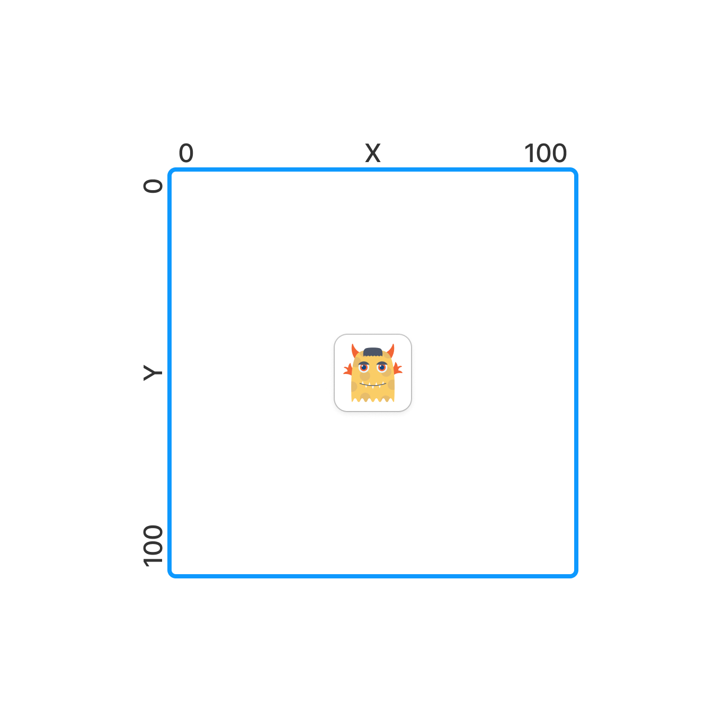

У вас есть переменные `x`, `y` и `direction` которые содержат входные пользовательские данные.

`x`, `y` содержат числа - стартовая позиция игрока. 

`direction` содержит направление движения, одного из: **up**, **down**, **left**, **right**.



Напишите код, который высчитывает новую позицию игрока после перемещения в этом направлении на 1 и записывает результат в переменную `result`

**Sample Input 1:**

```
1 1 down
```

**Sample Output 1:**

```
x: 1, y: 2, direction: down
```

**Sample Input 2:**

```
1 1 left
```

**Sample Output 2:**

```
x: 0, y: 1, direction: left
```

**Sample Input 3:**

```
1 1 right
```

**Sample Output 3:**

```
x: 2, y: 1, direction: right
```

**Sample Input 4:**

```
1 1 up
```

**Sample Output 4:**

```
x: 1, y: 0, direction: up
```