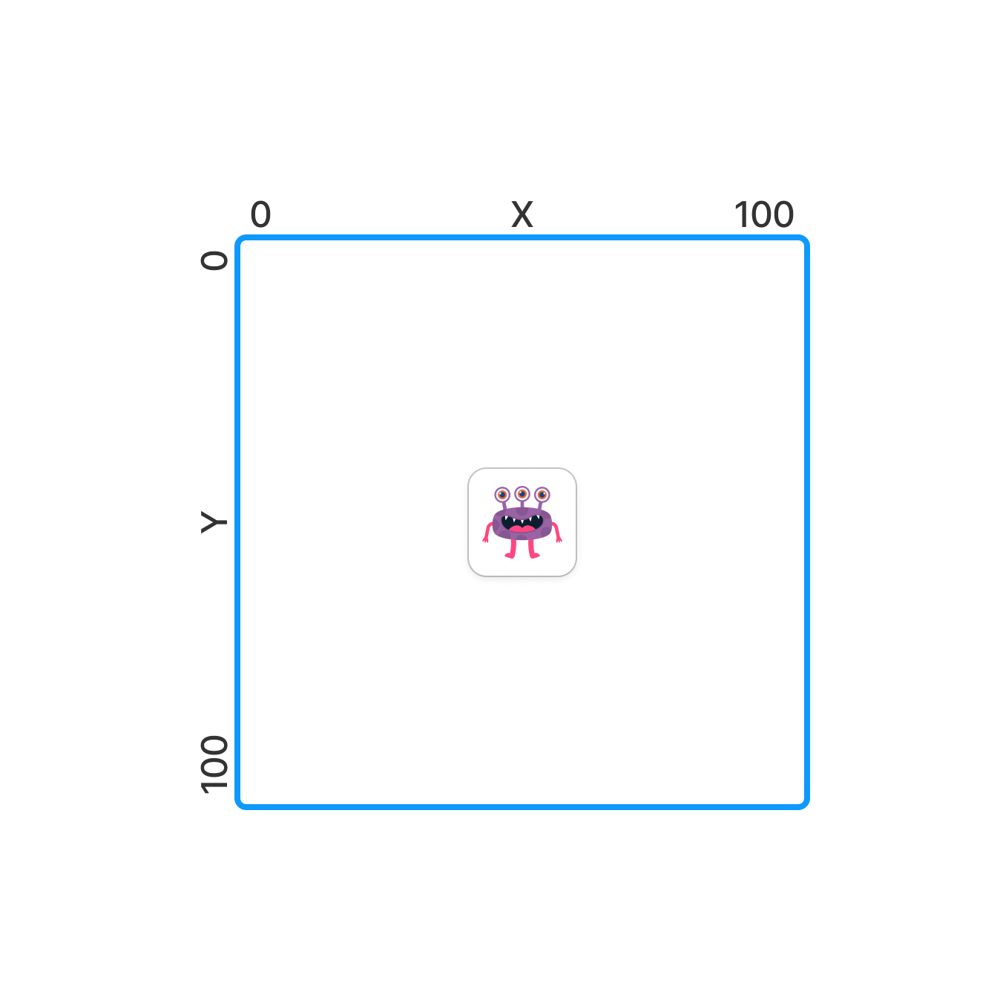

У вас есть переменные `x`, `y` и `direction` которые содержат входные пользовательские данные.

Игровое поле размера от 0 до 100 по `x` и от 0 до 100 по `y`.



`x`, `y` содержат числа - стартовая позиция игрока. 

`direction` содержит направление движения, одного из: **up**, **down**, **left**, **right**.

Напишите код, который высчитывает новую позицию игрока после перемещения в этом направлении на 1 и записывает результат в переменную `result`.

Учитывайте то, что новая позиция игрока не должна быть меньше 0 или больше 100 как `x` так и по `y`.

Например, если новая позиция игрока больше 100 тогда, устанавливаем ему значение 100, а если новая позиция игрока меньше 0 тогда устанавливаем ему значение 0 по `x` или по `y` в зависимости от того какую границу игрок перешел.

**Sample Input 1:**

```
99 99 down
```

**Sample Output 1:**

```
x: 99, y: 100, direction: down
```

**Sample Input 2:**

```
99 100 down
```

**Sample Output 2:**

```
x: 99, y: 100, direction: down
```