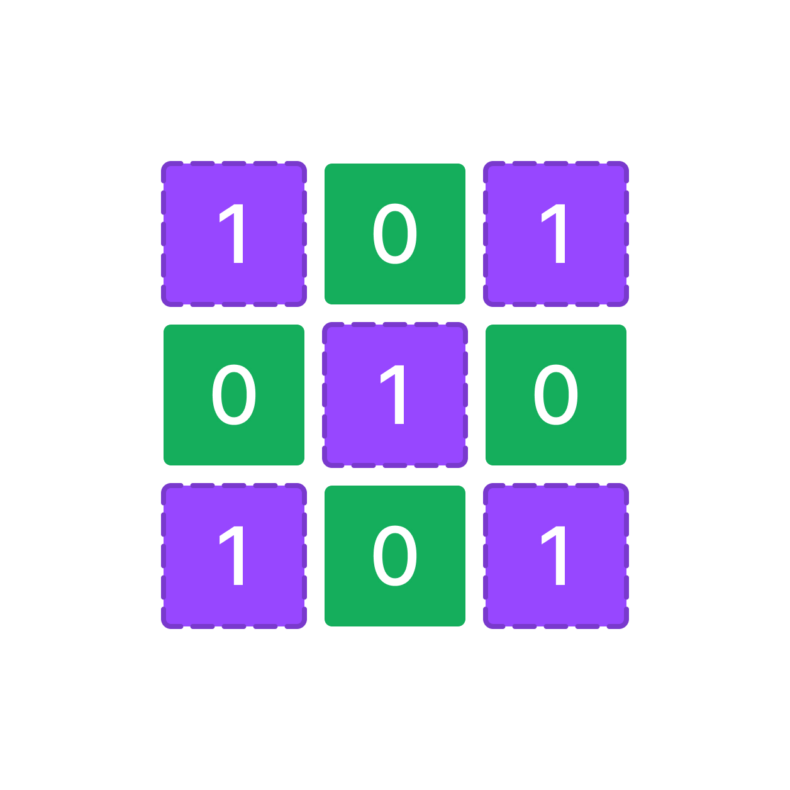

У вас есть переменная `grid` которая содержит входные пользовательские данные.

`grid` - двумерный массив из элементов типа данных `int`.

Напишите код, который находит сумму всех чисел по двум диагоналям двумерного массива `grid` и записывает результат в переменную `result`.

Обратите внимание на то, что ваш код должен работать для любого размера двухмерного массива `grid` например: 2х2, 3х3, 4х4 и тд...

**Важно!** Вам необходимо убедиться в том, что размер массива по высоте и ширине одинаковый! Если размеры массива `grid` тогда записываем `-1` в переменную `result`.

Например:

(1+1+1)+(1+1+1)=6(1+1+1)+(1+1+1)=6



**Sample Input 1:**

```
[[1, 0, 1],[0, 1, 0],[1, 1, 1]]
```

**Sample Output 1:**

```
6
```

**Sample Input 2:**

```
[[1, 0, 1],[0, 1, 0],[1, 1, 1],[1, 1, 1]]
```

**Sample Output 2:**

```
-1
```