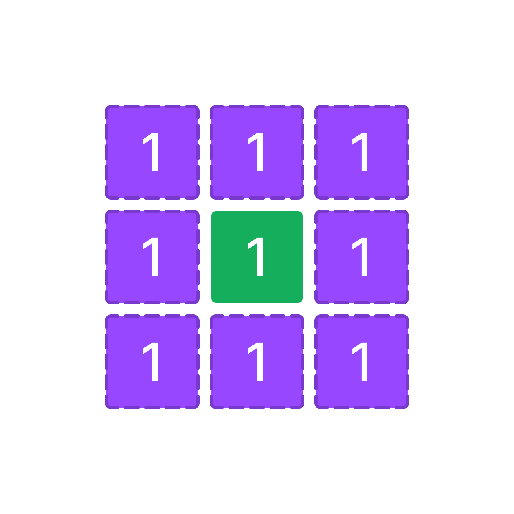

У вас есть переменная `grid` которая содержит входные пользовательские данные.

`grid` - двумерный массив из элементов типа данных `int`.

Напишите код, который находит сумму всех чисел по четырем границам двумерного массива `grid` и записывает результат в переменную `result`.

Обратите внимание на то, что ваш код должен работать для любого размера массива `grid` например: 2х5, 3х3, 8х4 и тд...

Например:

(1+1+1)+(1+1+1)+(1+1+1)+(1+1+1)=12(1+1+1)+(1+1+1)+(1+1+1)+(1+1+1)=12



**Sample Input 1:**

```
[[1, 1, 1],[1, 2, 1],[1, 1, 1]]
```

**Sample Output 1:**

```
12
```

**Sample Input 2:**

```
[[1, 1, 1],[1, 2, 1],[1, 1, 1],[1, 1, 1]]
```

**Sample Output 2:**

```
14
```