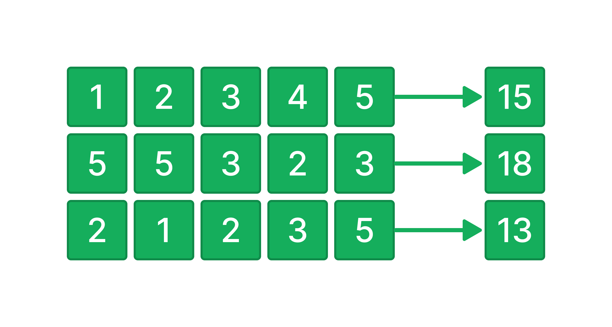

У вас есть переменная `data` которая содержит входные пользовательские данные.

`data` - двумерный массив из элементов типа данных `int`.

Напишите код, который находит сумму элементов для каждой строки двумерного массива `data` и записывает результат в новый массив.

Новый массив необходимо записать в переменную `result`.



**Sample Input:**

```
[[1,2,3,4,5],[5,5,3,2,3],[2,1,2,3,5]]
```

**Sample Output:**

```
[15,18,13]
```