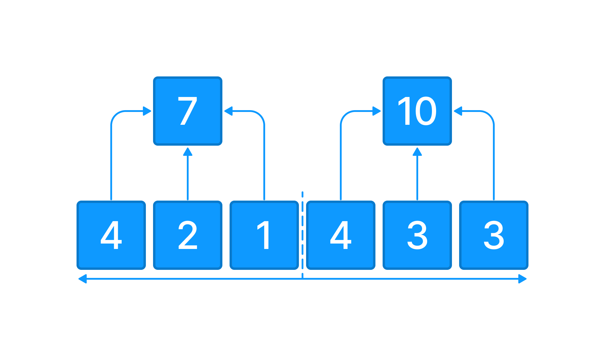

У вас есть переменная `data` которая содержит входные пользовательские данные.

`data` - массив из элементов типа данных `int`. Количество элементов всегда четное.

Напишите код, который определяет вес левой и правой стороны массива и записывает результат в переменную  `result`. 

**Условия:**

1. Если левая сторона имеет больший вес, тогда записываем сообщение: **Левая сторона тяжелее**
2. Если правая сторона имеет больший вес, тогда записываем сообщение: **Правая сторона тяжелее**
3. Если вес обеих сторон имеют одинаковый, тогда записываем сообщение: **Обе стороны сбалансированы**



**Sample Input 1:**

```
[4, 2, 1, 4, 3, 3]
```

**Sample Output 1:**

```
Правая сторона тяжелее
```

**Sample Input 2:**

```
[5, 5, 1, 4, 3, 3]
```

**Sample Output 2:**

```
Левая сторона тяжелее
```

**Sample Input 3:**

```
[5, 5, 1, 5, 1, 5]
```

**Sample Output 3:**

```
Обе стороны сбалансированы
```