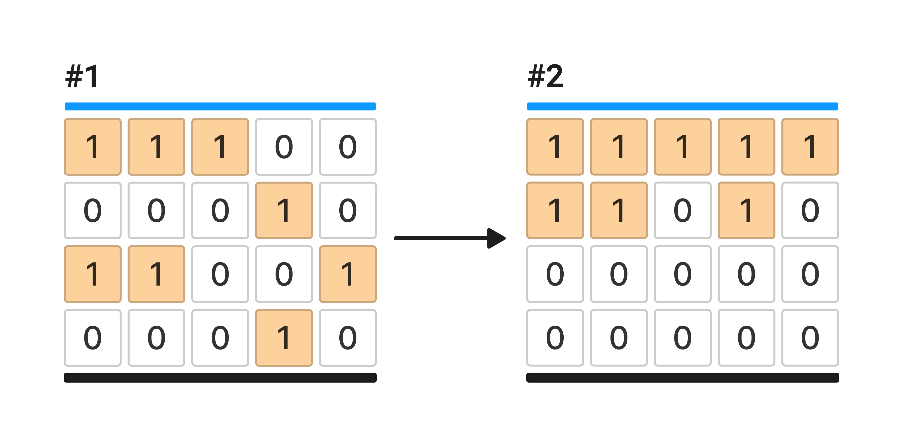

У вас есть переменная `grid` которая содержит входные пользовательские данные.

Переменная `grid` содержит двумерный список подвешенных блоков (**#1**), представленных в виде (**1**), в то время как (**0**) - это пустоты.

Напишите код, который создает новый список (**#2**), в котором к блокам применена условная инвертированная гравитация и они прижаты к потолку. Новый список запишите в переменную `result`.

**Важно!** Размер двумерного списка `grid` может быть любым.



**Sample Input 1:**

```
[[1,1,1,0,0],[0,0,0,1,0],[1,1,0,0,1],[0,0,0,1,0]]
```

**Sample Output 1:**

```
[[1,1,1,1,1],[1,1,0,1,0],[0,0,0,0,0],[0,0,0,0,0]]
```

**Sample Input 2:**

```
[[1,1,1,0,0],[0,0,0,1,0],[1,1,0,0,1],[1,1,1,1,1]]
```

**Sample Output 2:**

```
[[1,1,1,1,1],[1,1,1,1,1],[1,1,0,0,0],[0,0,0,0,0]]
```