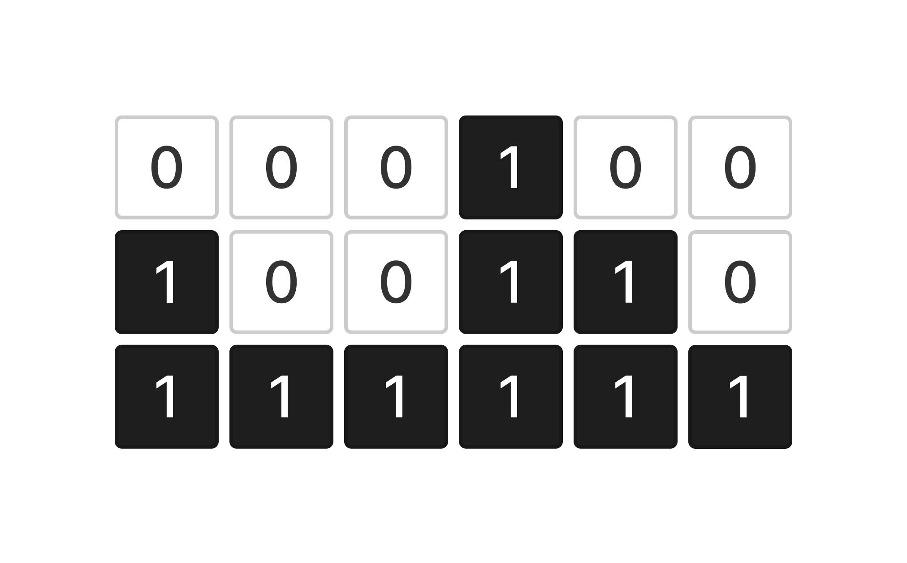
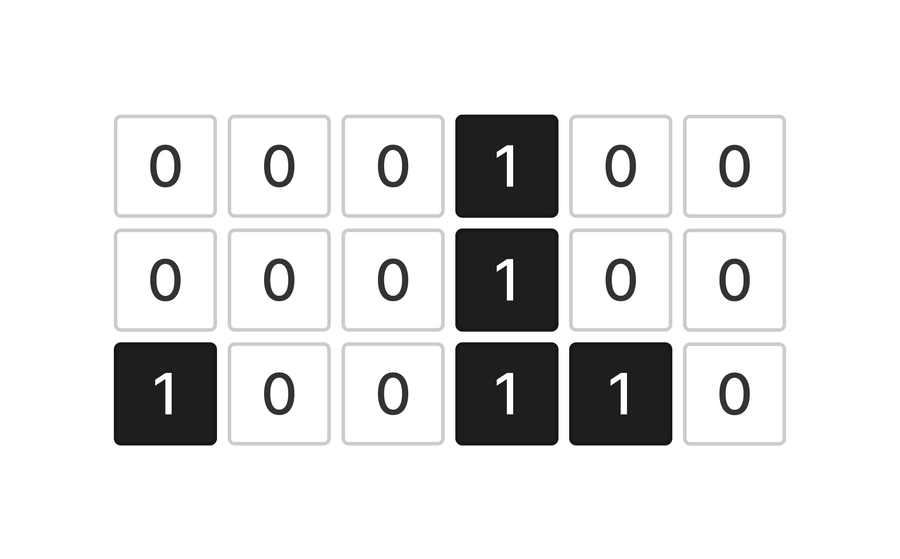

У вас есть переменная `grid` которая содержит входные пользовательские данные.

Напишите код, который подсчитывает количество одноэтажных, двухэтажных и трехэтажных башен и записывает результат в переменную `result`.

`1` - есть элемент башни
`0` - пустота

Размер двумерного массива 6х3
Башни располагаются снизу вверх.

**Например:**

```csharp
[
  [0,0,0,1,0,0],
  [1,0,0,1,1,0],
  [1,1,1,1,1,1]
]
                  
```

**одноэтажных башен: 3, двухэтажных башен: 2,  трехэтажных башен: 1**



```csharp
[
  [0,0,0,1,0,0],
  [0,0,0,1,0,0],
  [1,0,0,1,1,0]
]
                  
```

**одноэтажных башен: 2, двухэтажных башен: 0, трехэтажных башен: 1** 



**Sample Input 1:**

```
[[0,0,0,1,0,0],[1,0,0,1,1,0],[1,1,1,1,1,1]]
```

**Sample Output 1:**

```
одноэтажных башен: 3, двухэтажных башен: 2, трехэтажных башен: 1
```

**Sample Input 2:**

```
[[0,0,0,1,0,0],[1,1,1,1,1,1],[1,1,1,1,1,1]]
```

**Sample Output 2:**

```
одноэтажных башен: 0, двухэтажных башен: 5, трехэтажных башен: 1
```