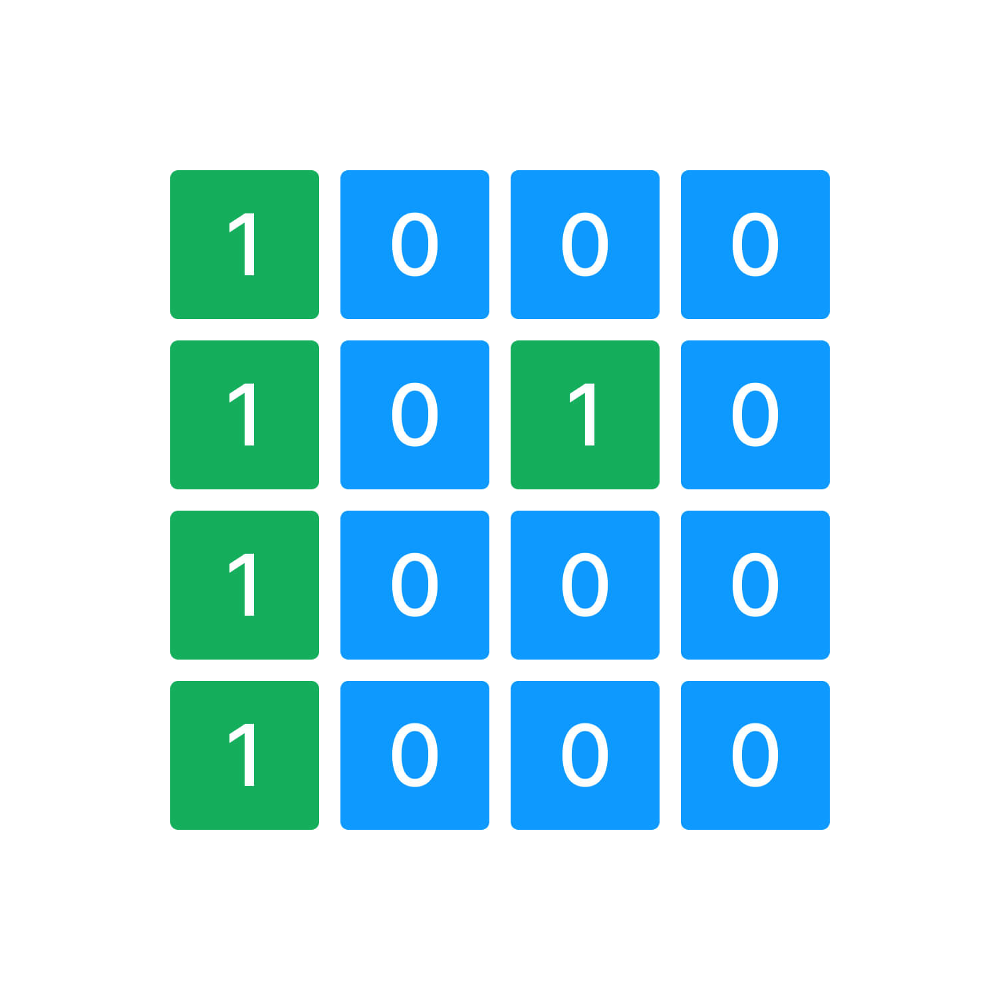

У вас есть переменная `grid` которая содержит входные пользовательские данные.

`grid` - двухмерный массив из элементов типа данных `int`. 

Напишите код, который подсчитывает количество блоков воды и блоков земли в двумерном массиве `grid` и записывает результат в переменную `result`.

`0` - блок воды на карте
`1` - блок земли на карте

Размер двумерного массива 4х4 

Например:

**блоков воды: 11, блоков земли: 5**

```javascript
[
  [1,0,0,0],
  [1,0,1,0],
  [1,0,0,0],
  [1,0,0,0]
]
                  
```



**Sample Input:**

```
[[1,0,0,0],[1,0,1,0],[1,0,0,0],[1,0,0,0]]
```

**Sample Output:**

```
блоков воды: 11, блоков земли: 5
```