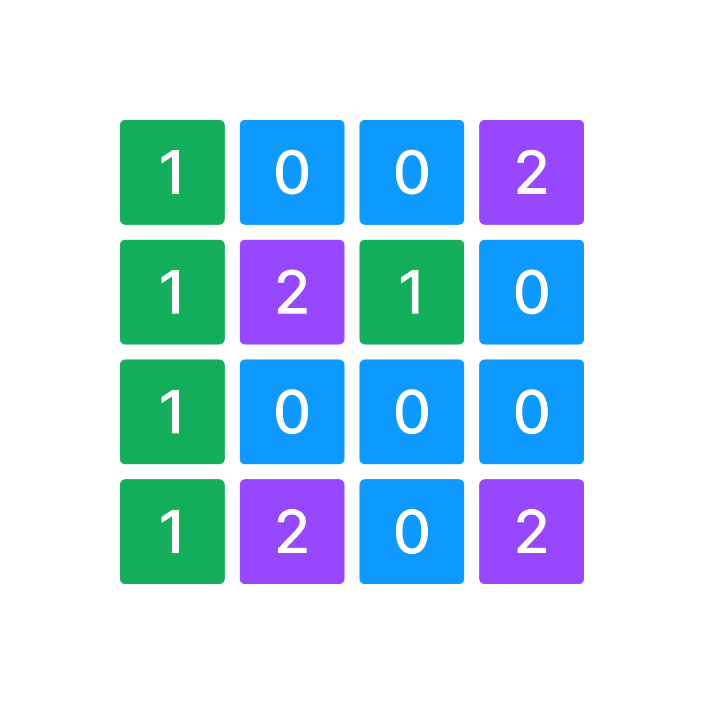

У вас есть переменная `grid` которая содержит входные пользовательские данные.

`grid` - двухмерный массив из элементов типа данных `int`. 

Напишите код, который подсчитывает количество блоков воды, блоков земли и блоков кораблей в двумерном массиве `grid` и записывает результат в переменную `result`.

`0` - блок воды на карте.
`1` - блок земли на карте.
`2` - блок корабля на карте.

Размер двумерного массива 4х4 

Например:

**блоков воды: 7, блоков земли: 5, блоков кораблей: 4**

```javascript
[
  [1,0,0,2],
  [1,2,1,0],
  [1,0,0,0],
  [1,2,0,2]
]
                  
```



**Sample Input:**

```
[[1,0,0,2],[1,2,1,0],[1,0,2,0],[1,2,0,2]]
```

**Sample Output:**

```
блоков воды: 6, блоков земли: 5, блоков кораблей: 5
```