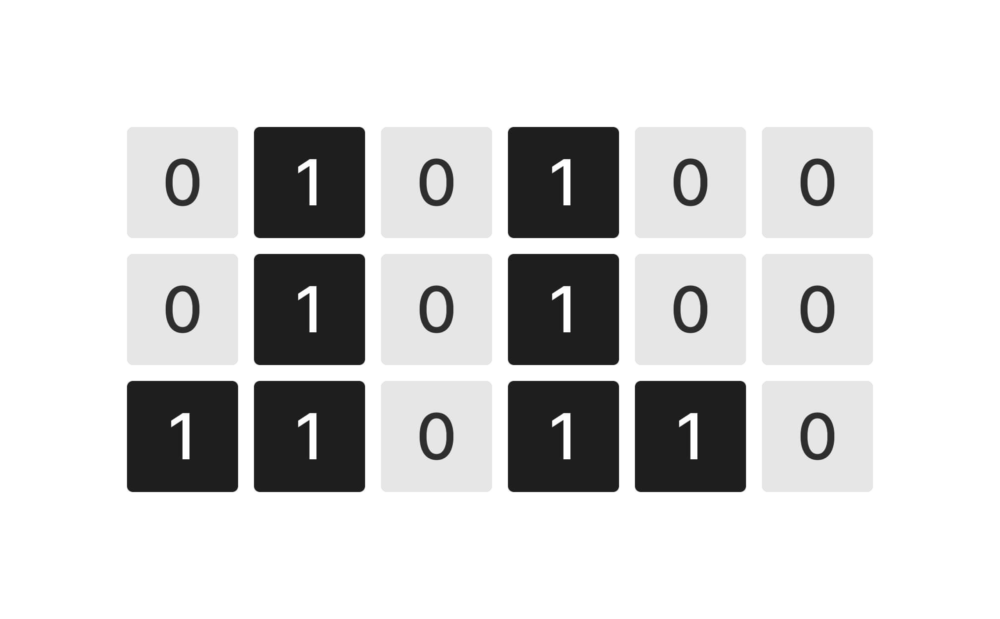
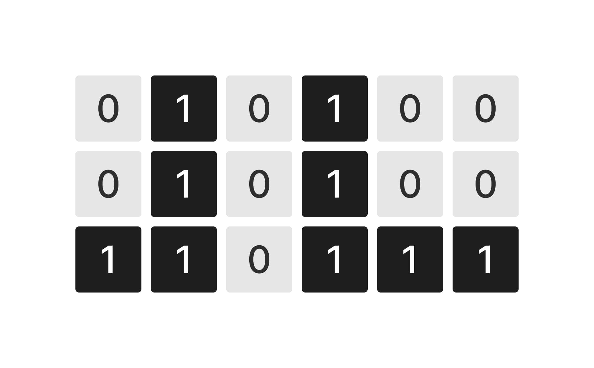
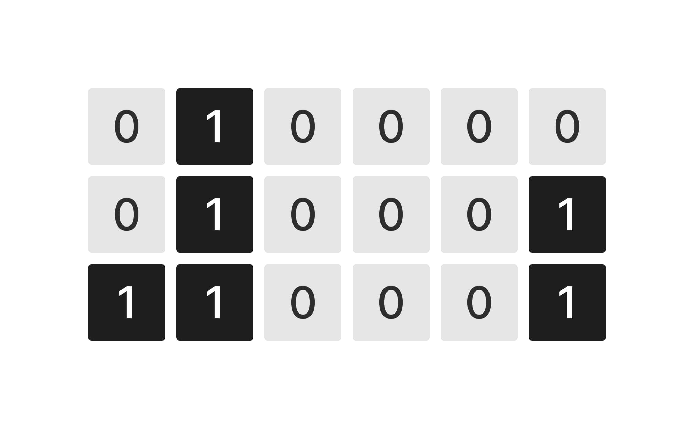

У вас есть переменная `grid` которая содержит входные пользовательские данные.

`grid` - двухмерный массив из элементов типа данных `int`. 

Напишите код, который подсчитывает количество пустых мест, на которых могли бы быть построены еще башни и записывает результат в переменную `result`.

`1` - есть элемент башни
`0` - пустота

Размер двумерного массива 6х3
Башни располагаются снизу вверх.

Например:

**2 пустых места**

```javascript
[
  [0,1,0,1,0,0],
  [0,1,0,1,0,0],
  [1,1,0,1,1,0]
]
                  
```

 



**1 пустое место**

```javascript
[
  [0,1,0,1,0,0],
  [0,1,0,1,0,0],
  [1,1,0,1,1,1]
]
                  
```

 



**3 пустых места** 

```javascript
[
  [0,1,0,0,0,0],
  [0,1,0,0,0,1],
  [1,1,0,0,0,1]
]
                  
```



**Sample Input:**

```
[[0,1,0,1,0,0],[0,1,0,1,0,0],[1,1,0,1,1,0]]
```

**Sample Output:**

```
2
```