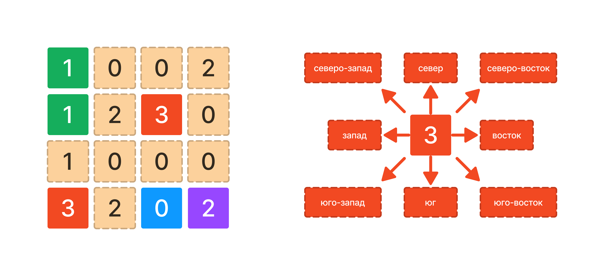

У вас есть переменная `grid` которая содержит входные пользовательские данные.

`grid` - двухмерный массив из элементов типа данных `int`. 

Напишите код, который определяет какие блоки граничат на северо-востоке, севере, северо-западе, востоке, юго-востоке, юге, юго-западе, западе с блоком вулкана в списке `grid` и записывает результат в переменную `result`. Вулканов на поле может быть несколько. Минимум один вулкан всегда присутствует в списке `grid` .

`0` - блок воды на карте.
`1` - блок земли на карте.
`2` - блок корабля на карте.
`3` - блок вулкана на карте.

Размер двумерного списка 4х4 

Например:

**Вулкан 1 граничит на северо-западе с водой, на севере с водой, на северо-востоке с кораблем, на востоке с водой, на юго-востоке с водой, на юге с водой, на юге-западе с водой, на западе с кораблем. Вулкан 2 граничит на севере с землей, на северо-востоке с водой, на востоке с кораблем.**

```javascript
[
  [1,0,0,2],
  [1,2,3,0],
  [1,0,0,0],
  [3,2,0,2]
]
                  
```



**Sample Input 1:**

```
[[1,0,0,2],[1,2,3,0],[1,0,0,0],[3,2,0,2]]
```

**Sample Output 1:**

```
Вулкан 1 граничит на северо-западе с водой, на севере с водой, на северо-востоке с кораблем, на востоке с водой, на юго-востоке с водой, на юге с водой, на юго-западе с водой, на западе с кораблем. Вулкан 2 граничит на севере с землей, на северо-востоке с водой, на востоке с кораблем.
```

**Sample Input 2:**

```
[[3,3,3,3],[3,2,0,3],[3,0,0,3],[3,3,3,3]]
```

**Sample Output 2:**

```
Вулкан 1 граничит на востоке с вулканом, на юго-востоке с кораблем, на юге с вулканом. Вулкан 2 граничит на востоке с вулканом, на юго-востоке с водой, на юге с кораблем, на юго-западе с вулканом, на западе с вулканом. Вулкан 3 граничит на востоке с вулканом, на юго-востоке с вулканом, на юге с водой, на юго-западе с кораблем, на западе с вулканом. Вулкан 4 граничит на юге с вулканом, на юго-западе с водой, на западе с вулканом. Вулкан 5 граничит на севере с вулканом, на северо-востоке с вулканом, на востоке с кораблем, на юго-востоке с водой, на юге с вулканом. Вулкан 6 граничит на северо-западе с вулканом, на севере с вулканом, на юге с вулканом, на юго-западе с водой, на западе с водой. Вулкан 7 граничит на севере с вулканом, на северо-востоке с кораблем, на востоке с водой, на юго-востоке с вулканом, на юге с вулканом. Вулкан 8 граничит на северо-западе с водой, на севере с вулканом, на юге с вулканом, на юго-западе с вулканом, на западе с водой. Вулкан 9 граничит на севере с вулканом, на северо-востоке с водой, на востоке с вулканом. Вулкан 10 граничит на северо-западе с вулканом, на севере с водой, на северо-востоке с водой, на востоке с вулканом, на западе с вулканом. Вулкан 11 граничит на северо-западе с водой, на севере с водой, на северо-востоке с вулканом, на востоке с вулканом, на западе с вулканом. Вулкан 12 граничит на северо-западе с водой, на севере с вулканом, на западе с вулканом.
```