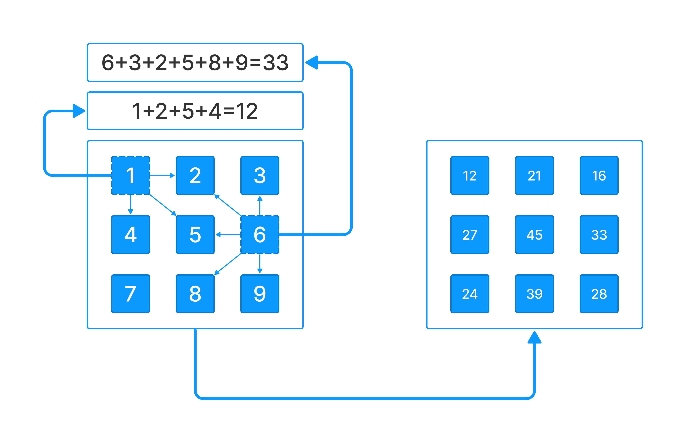

У вас есть переменная `grid` которая содержит входные пользовательские данные.

Напишите код, который создает новый список, в котором каждый элемент - это сумма соседних элементов включая текущий.

Новый список необходимо записать в переменную `result`.



**Sample Input:**

```
[[1,2,3],[4,5,6],[7,8,9]]
```

**Sample Output:**

```
[[12,21,16],[27,45,33],[24,39,28]]
```