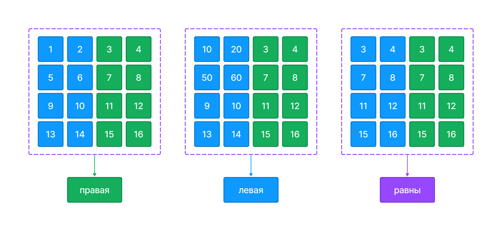

У вас есть переменная `grid` которая содержит входные пользовательские данные.

`grid` - двумерный список чисел произвольного размера но с равным количеством элементов, 6x6, 8x8, 10x10 и тд - всегда четное количество.



Напишите код, который определяет какая половина двумерного списка больше и записывает результат в переменную `result`.

**Sample Input 1:**

```
[[1,2,3,4],[5,6,7,8],[9,10,11,12],[13,14,15,16]]
```

**Sample Output 1:**

```
правая
```

**Sample Input 2:**

```
[[10,10,3,4],[50,60,7,8],[9,10,11,12],[13,14,15,16]]
```

**Sample Output 2:**

```
левая
```

**Sample Input 3:**

```
[[3,4,3,4],[7,8,7,8],[11,12,11,12],[15,16,15,16]]
```

**Sample Output 3:**

```
равны
```