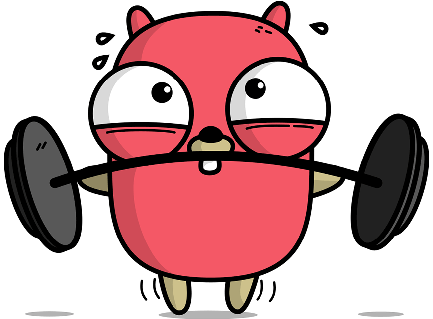
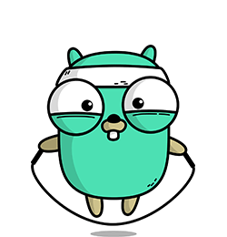

## Самый полный **Практический Тренажер по GO** для **начинающих программистов на платформе Stepik!**

 



 


**Go** (или **Golang**) - это высокоуровневый язык программирования, разработанный компанией **Google**. Он был создан с целью упростить разработку программных приложений, обладать высокой производительностью и быть легким в использовании. Основные принципы, лежащие в основе языка **Go**, - это простота, эффективность и надежность.

**Go** имеет огромное сообщество разработчиков, которые активно поддерживают и развивают язык, предлагая множество библиотек и модулей, которые значительно упрощают разработку. **Go** также является одним из наиболее востребованных языков программирования на рынке труда, что делает его привлекательным выбором для тех, кто стремится к карьерному росту.


Этот **курс состоит исключительно из практических задач**, которые помогут вам улучшить свои навыки в работе с переменными, типами данных, условными конструкциями, циклами, функциями, массивами, строками в **Go**. В ходе выполнения задач вы научитесь применять свои знания на практике, улучшите навыки работы с **Go** и укрепите уверенность в своих возможностях.

Кроме того, в этом курсе **включены задачи на собеседования**. Они позволят вам не только отработать навыки работы с **Go**, но и подготовиться к собеседованию на позицию **Go-разработчика**. Вы научитесь решать типичные задачи, которые могут быть предложены на собеседовании, и узнаете, как правильно формулировать свои ответы.

Таким образом, этот курс поможет вам улучшить навыки работы с **Go** и подготовиться к собеседованию на позицию **Go-разработчика**.


## Преимущества курса

1. **Практический подход к обучению.**
   Курс полностью ориентирован на практику: студенты сразу приступают к решению задач, что ускоряет процесс освоения **Go**. Такой формат позволяет глубже понять язык и применить знания на реальных примерах.
    
2. **Подготовка к собеседованиям в крупных компаниях.**
   Включение задач, похожих на те, что встречаются на собеседованиях, дает студентам возможность подготовиться к интервью в крупнейших технологических компаниях. Это позволяет студентам чувствовать себя уверенно и уверенно отвечать на сложные вопросы.
    
3. **Всеобъемлющее покрытие базовых и продвинутых тем Go.**
   Курс охватывает ключевые аспекты программирования на **Go**: переменные, типы данных, условные конструкции, циклы и алгоритмы, что формирует прочную базу и помогает развить как базовые, так и более продвинутые навыки.
    
4. **Регулярные обновления.**
   Благодаря регулярным обновлениям **Go** Тренажера курс постоянно пополняется новыми интересными задачами. Это поддерживает интерес студентов, позволяет адаптироваться к актуальным тенденциям в разработке, и создает ощущение непрерывного роста.
    
5. **Развитие логического и алгоритмического мышления.**
   Решение разнообразных задач и алгоритмических проблем на курсе способствует развитию логического мышления, структурированного подхода к решению задач и внимательности к деталям, что является важной частью работы программиста.
    
6. **Активное сообщество.**
   Студенты активно обмениваются своими решениями, участвуют в обсуждениях и учатся на опыте и ошибках других студентов. Они получают ценные советы и рекомендации как от других студентов, так и от автора курса.


**Практический Тренажер по GO** постоянно пополняется разнообразными и интересными задачами, в результате чего курс постепенно расширяется и становится еще более насыщенным. Каждое обновление **Практический Тренажер по GO** приносит с собой новые увлекательные вызовы и возможности для изучения **Go**.




## Для кого этот курс

Курс будет полезен: специалистам в сфере информационных технологий, разработчикам программного обеспечения, разработчикам серверной части, разработчикам распределённых систем, специалистам по обработке данных, системным администраторам, а также специалистам по тестированию программного обеспечения.

## Начальные требования

Для успешного прохождения курса "**Практический Тренажер по GO**" требуются базовые знания из школьной программы по **информатике** и **математике**, а также **базовый уровень владения языком программирования Go**. Если вы уже изучали **Go** и имеете опыт работы с ним, то этот курс поможет вам улучшить ваши навыки и подготовиться к новым вызовам.

Если же вы новичок в программировании или только начинаете изучать **Go**, то рекомендуем предварительно или паралельно изучить **Go** на базовом уровне. Это поможет вам быстрее и легче освоить материал курса и получить максимальную пользу от его прохождения.

## Наши преподаватели

1. [IT Guru](https://stepik.org/users/561566563)

   Интерактивные курсы и тренажеры по JavaScript, Python, Java, C#, SQL, GO, Kotlin, PHP

   ```
   Проект, который включает интерактивные курсы и тренажеры, предлагая эффективное обучение для всех. Он позволяет осваивать новые навыки через баланс теории и практики, обеспечивая доступный, удобный и увлекательный процесс обучения.
   
   На курсах IT Guru обучается более 60…
   ```

### Сертификат

Сертификаты выдаются:
Stepik

-  **350** баллов — об окончании
-  **370** баллов — с отличием